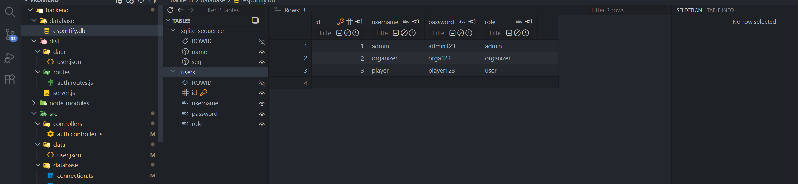

# Documentation SQL — Esportify+

## Objectif du document

Ce document présente la partie SQL utilisée dans le projet Esportify+.

Il accompagne la capture `EsportifyDb.png`, qui montre l’état actuel de la base SQLite utilisée pour la démonstration du backend.

---

## Rôle de la base de données

La base SQLite permet de stocker les comptes de démonstration utilisés par le backend Express.

Elle sert principalement à tester :

- la connexion des utilisateurs ;
- la récupération des comptes ;
- la gestion des rôles ;
- la communication entre le backend et les données ;
- la persistance des informations utilisées par l’API.

---

## Capture de la base

La capture montre la table `users`, utilisée pour représenter les différents profils disponibles dans l’application.

---

## Table actuelle : `users`

La table `users` contient les comptes de démonstration du projet.

| Champ | Rôle |
|---|---|
| `id` | Identifiant unique de l’utilisateur |
| `username` | Nom utilisé pour la connexion |
| `password` | Empreinte bcrypt du mot de passe |
| `role` | Rôle attribué à l’utilisateur |

Le champ `username` est unique.

Le champ `role` accepte uniquement les valeurs suivantes :

- `player` ;
- `organizer` ;
- `admin`.

---

## Rôles présents

Les rôles actuellement utilisés sont :

- `admin` : accès aux fonctionnalités d’administration ;
- `organizer` : accès aux fonctionnalités d’organisation ;
- `player` : accès aux fonctionnalités joueur.

Ces rôles permettent de simuler plusieurs parcours dans l’application Esportify+.

---

## Sécurité des mots de passe

Les mots de passe de démonstration sont enregistrés sous forme d’empreintes bcrypt.

Lors de la connexion, le backend compare le mot de passe saisi à l’empreinte enregistrée dans SQLite.

Le mot de passe et son empreinte ne sont jamais transmis au frontend.

---

## Utilisation dans le backend

Le backend Express utilise cette base pour vérifier les identifiants et retourner le rôle associé à l’utilisateur.

Ce fonctionnement permet ensuite au frontend d’adapter l’affichage selon le profil connecté.

Exemples :

- un administrateur accède à la page Admin ;
- un organisateur accède à la page Organisateur ;
- un joueur accède aux fonctionnalités classiques.

Le répertoire destiné à la base SQLite est créé automatiquement par le backend avant l’ouverture du fichier `esportify.db`.

---

## Choix de SQLite

SQLite a été choisi car il est simple à mettre en place pour un projet de démonstration.

Ce choix permet :

- d’éviter une installation complexe ;
- de tester rapidement le backend ;
- de conserver une base légère ;
- de faciliter les tests automatisés ;
- de préparer une évolution future vers une base plus complète.

---

## Limites actuelles

La base actuelle reste volontairement simple.

Elle ne gère pas encore :

- la création persistante de nouveaux comptes depuis le formulaire d’inscription ;
- les événements en base ;
- les tournois ;
- les inscriptions aux événements ;
- les replays ;
- les messages entre utilisateurs ;
- l’archivage des résultats.

Ces éléments constituent des pistes d’évolution pour une version plus complète du projet.

---

## Évolutions possibles

Dans une version plus complète, la base pourrait être étendue avec plusieurs tables :

- `roles` ;
- `users` ;
- `events` ;
- `tournaments` ;
- `replays` ;
- `registrations` ;
- `messages`.

Cela permettrait de gérer réellement :

- les comptes utilisateurs ;
- les rôles ;
- les événements esport ;
- les tournois ;
- les inscriptions ;
- les replays ;
- les messages ;
- l’archivage des anciennes compétitions.

---

## Conclusion

Cette base SQLite constitue une première démonstration fonctionnelle pour Esportify+.

Elle permet de relier le backend Express à des données persistantes, de sécuriser l’authentification avec bcrypt et de gérer plusieurs rôles utilisateur.

Même si elle reste volontairement simple, elle montre la séparation entre les données, le backend et l’interface utilisateur, tout en préparant une évolution vers une architecture plus complète.