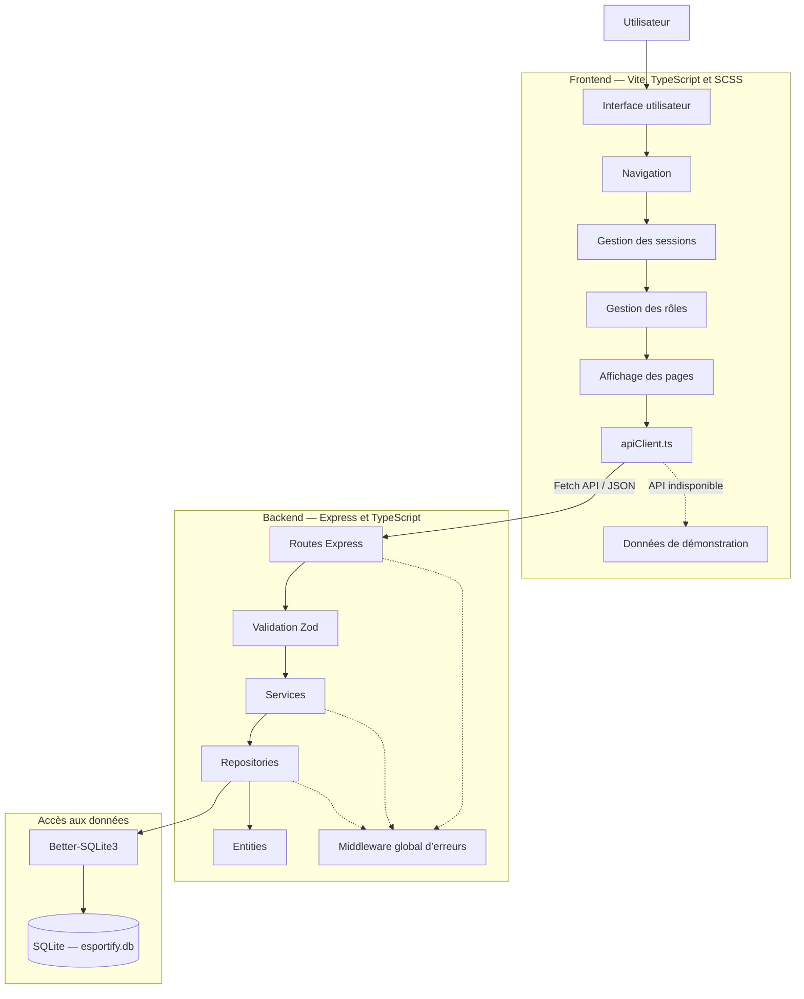
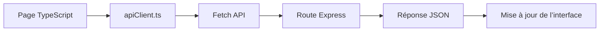
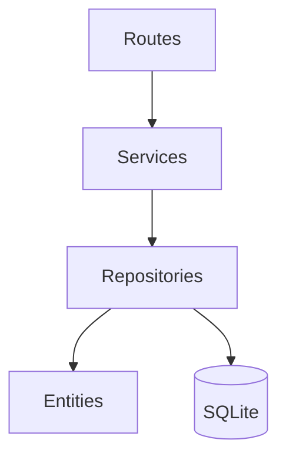
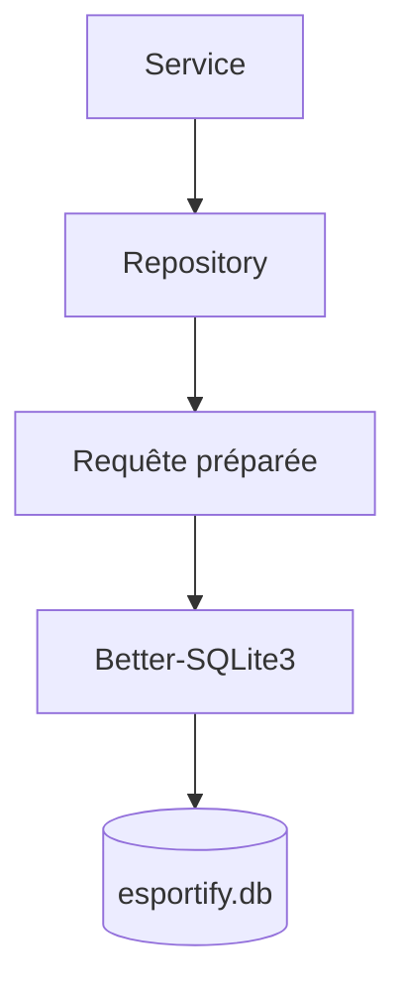
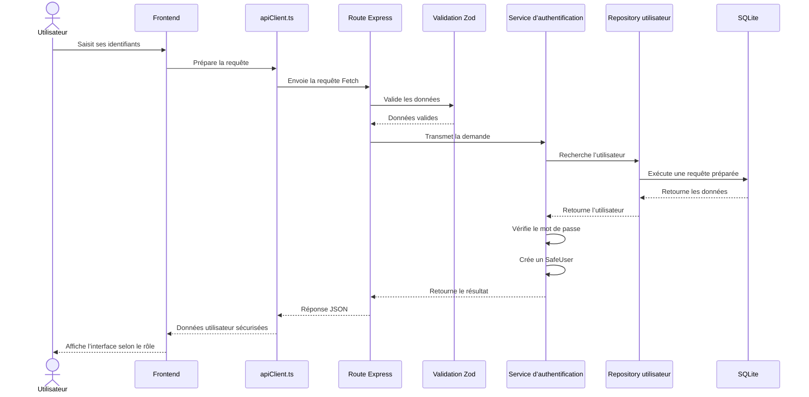
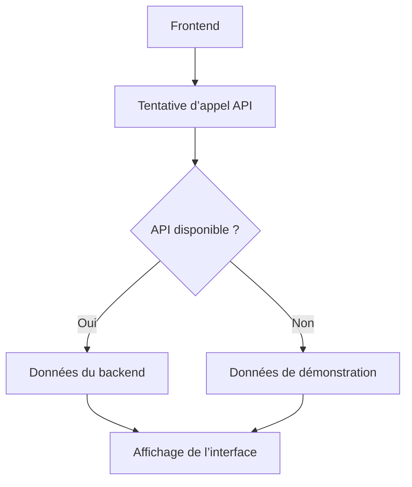
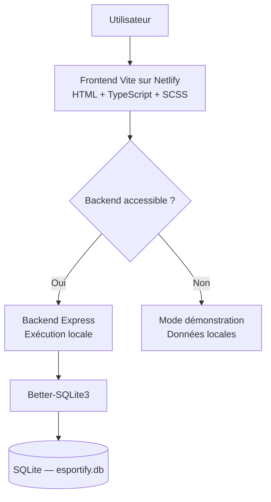
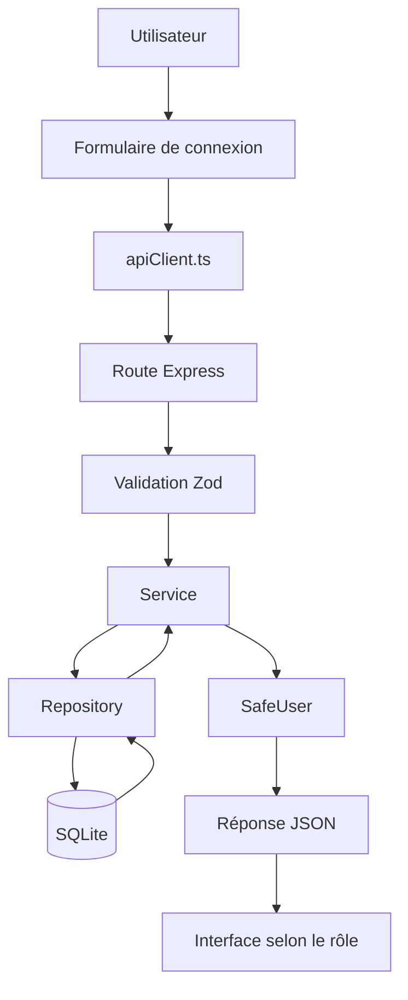

# Architecture applicative — Esportify+

## Plan du document

1. [Objectif de l’architecture](#1-objectif-de-larchitecture)
2. [Vue d’ensemble](#2-vue-densemble)
3. [Technologies principales](#3-technologies-principales)
4. [Architecture générale](#4-architecture-générale)
5. [Organisation du frontend](#5-organisation-du-frontend)
6. [Communication entre le frontend et le backend](#6-communication-entre-le-frontend-et-le-backend)
7. [Organisation du backend](#7-organisation-du-backend)
8. [Accès aux données et SQLite](#8-accès-aux-données-et-sqlite)
9. [Authentification et gestion des rôles](#9-authentification-et-gestion-des-rôles)
10. [Validation et gestion des erreurs](#10-validation-et-gestion-des-erreurs)
11. [Mode de démonstration](#11-mode-de-démonstration)
12. [Architecture de déploiement](#12-architecture-de-déploiement)
13. [Exemple de circulation d’une requête](#13-exemple-de-circulation-dune-requête)
14. [Maintenabilité et évolutivité](#14-maintenabilité-et-évolutivité)
15. [Limites actuelles](#15-limites-actuelles)
16. [Évolutions envisagées](#16-évolutions-envisagées)
17. [Conclusion](#17-conclusion)

---

## 1. Objectif de l’architecture

L’objectif de cette architecture est de séparer clairement les responsabilités entre :

- l’interface utilisateur ;
- la navigation ;
- la gestion des sessions ;
- la communication avec l’API ;
- la logique métier ;
- la validation des données ;
- l’accès à la base de données ;
- les modèles et entités métier.

Cette organisation améliore :

- la maintenabilité ;
- la lisibilité ;
- la stabilité ;
- la réutilisation du code ;
- la facilité de test ;
- l’évolutivité du projet.

Esportify+ a progressivement évolué d’un prototype principalement orienté front-end vers une application client-serveur structurée, utilisant un backend Express et une base SQLite.

---

## 2. Vue d’ensemble

Esportify+ repose sur une architecture client-serveur.

Le frontend est responsable :

- de l’affichage ;
- des interactions utilisateur ;
- de la navigation ;
- de la gestion de l’état de session côté navigateur ;
- de l’envoi des requêtes au backend ;
- de l’affichage des réponses et des erreurs.

Le backend est responsable :

- de la réception des requêtes ;
- de la validation des données ;
- de la logique métier ;
- du contrôle des rôles ;
- de l’accès aux données ;
- de la construction des réponses JSON ;
- de la gestion centralisée des erreurs.

La base SQLite assure la persistance des données locales du projet.

---

## 3. Technologies principales

### Frontend

- Vite ;
- TypeScript ;
- HTML ;
- SCSS ;
- Fetch API.

### Backend

- Node.js ;
- Express ;
- TypeScript ;
- Zod ;
- Better-SQLite3.

### Base de données

- SQLite ;
- requêtes préparées ;
- contraintes SQL ;
- clés étrangères ;
- index ;
- mode WAL.

### Outils complémentaires

- Git et GitHub ;
- Docker ;
- Docker Compose ;
- Netlify pour le frontend ;
- documentation Markdown ;
- diagrammes Mermaid.

---

## 4. Architecture générale



Cette architecture limite les dépendances directes entre l’interface et la base de données.

Le frontend ne communique jamais directement avec SQLite. Toutes les opérations passent par le backend Express.

---

## 5. Organisation du frontend

Le frontend est construit avec Vite, TypeScript et SCSS.

Les responsabilités sont réparties entre plusieurs fichiers spécialisés.

### Pages TypeScript

Les fichiers présents dans `src/pages` gèrent les comportements propres aux différentes pages :

- `index.ts` ;
- `events.ts` ;
- `inscription.ts` ;
- `organisateur.ts` ;
- `replay.ts` ;
- `contact.ts`.

Chaque fichier contient uniquement la logique nécessaire à la page concernée.

### Fichiers communs

Plusieurs fichiers regroupent les comportements réutilisables :

- `apiClient.ts` : communication avec le backend ;
- `data.ts` : données de démonstration et données locales ;
- `navigation.ts` : navigation et comportements communs ;
- `sessions.ts` : gestion de la session utilisateur ;
- `vite-env.d.ts` : types liés à l’environnement Vite.

### Styles SCSS

Les styles sont séparés selon leur responsabilité :

- styles de base ;
- composants ;
- mise en page ;
- pages ;
- thèmes ;
- interfaces Administrateur et Organisateur ;
- page Replay.

Cette séparation évite de concentrer toute la présentation dans un seul fichier.

---

## 6. Communication entre le frontend et le backend

La communication entre les deux parties repose sur la Fetch API.

Le fichier `apiClient.ts` centralise les appels réseau.

Il permet notamment de gérer :

- l’URL de l’API ;
- les requêtes HTTP ;
- les en-têtes ;
- les données JSON ;
- les réponses du serveur ;
- les erreurs réseau ;
- les délais d’attente ;
- le fallback vers le mode démonstration.

### Schéma de communication



### Format des échanges

Le frontend envoie les données au backend au format JSON.

Le backend renvoie également des réponses JSON contenant selon les cas :

- un résultat ;
- un utilisateur sécurisé ;
- un message ;
- une erreur ;
- un code d’état HTTP.

---

## 7. Organisation du backend

Le backend suit une architecture en couches.



### Routes

Les routes définissent les points d’entrée de l’API.

Elles sont responsables de :

- recevoir la requête ;
- extraire les paramètres ;
- appeler la validation ;
- transmettre les données au service ;
- renvoyer la réponse HTTP.

Exemples de routes présentes :

- authentification ;
- vérification de l’état de l’API ;
- version de l’application.

### Services

Les services contiennent la logique métier.

Ils permettent notamment de :

- contrôler les règles fonctionnelles ;
- vérifier les données ;
- appeler les repositories ;
- préparer les résultats ;
- éviter de placer la logique métier dans les routes.

### Repositories

Les repositories centralisent l’accès aux données.

Ils sont responsables de :

- préparer les requêtes SQL ;
- lire les informations ;
- ajouter ou modifier les données ;
- transformer les résultats SQLite ;
- isoler la base de données du reste de l’application.

### Entities

Les entités représentent les objets métier de l’application.

Le projet utilise notamment :

- `UserEntity` ;
- le type sécurisé `SafeUser`.

L’entité utilisateur permet de centraliser certaines règles et d’éviter d’exposer directement les données sensibles.

---

## 8. Accès aux données et SQLite

Le projet utilise SQLite avec Better-SQLite3.

La connexion est centralisée dans une couche dédiée.

### Fonctionnement



### Mécanismes de fiabilité

La configuration SQLite utilise notamment :

```sql
PRAGMA foreign_keys = ON;
PRAGMA journal_mode = WAL;
PRAGMA busy_timeout = ...;
```

Ces options permettent :

- d’activer les relations entre les tables ;
- d’améliorer la fiabilité des écritures ;
- de mieux gérer les accès concurrents ;
- de réduire les risques de blocage.

### Tables principales

Le schéma prévoit les principales entités suivantes :

- `roles` ;
- `users` ;
- `events` ;
- `tournaments` ;
- `replays` ;
- `registrations` ;
- `messages`.

### Contraintes SQL

Les données sont protégées avec :

- `PRIMARY KEY` ;
- `FOREIGN KEY` ;
- `UNIQUE` ;
- `CHECK` ;
- index.

Les requêtes préparées réduisent également les risques d’injection SQL.

---

## 9. Authentification et gestion des rôles

Le projet utilise trois rôles principaux :

- `player` ;
- `organizer` ;
- `admin`.

Cette nomenclature est utilisée de manière cohérente dans :

- le frontend ;
- le backend ;
- SQLite ;
- la documentation.

### Flux d’authentification



Le mot de passe n’est pas renvoyé au frontend.

Le type `SafeUser` permet de ne transmettre que les informations nécessaires à l’interface.

Le projet utilise également bcrypt pour le hachage des mots de passe.

---

## 10. Validation et gestion des erreurs

### Validation avec Zod

Les données reçues par l’API sont contrôlées avant leur utilisation.

La validation vérifie notamment :

- le nom d’utilisateur ;
- le mot de passe ;
- les champs obligatoires ;
- le type des données ;
- la cohérence du format reçu.

Une donnée invalide est rejetée avant d’atteindre la logique métier ou la base de données.

### Middleware global d’erreurs

Un middleware global centralise le traitement des erreurs.

Il permet :

- d’éviter la duplication de blocs de gestion d’erreurs ;
- d’uniformiser les réponses ;
- de renvoyer un code HTTP adapté ;
- de limiter l’exposition des détails internes ;
- de faciliter la maintenance.

### Sécurisation Express

Le backend applique également plusieurs protections :

- désactivation de `X-Powered-By` ;
- contrôle des routes ;
- validation systématique ;
- réponses JSON cohérentes ;
- séparation entre erreurs techniques et erreurs utilisateur.

---

## 11. Mode de démonstration

Le frontend peut utiliser des données de démonstration lorsque le backend n’est pas disponible.



Ce fonctionnement permet :

- de présenter l’interface sans lancer le backend ;
- de conserver une démonstration fonctionnelle sur Netlify ;
- de limiter les erreurs bloquantes ;
- de faciliter les tests du frontend.

Le mode de démonstration ne remplace pas la persistance SQLite. Il sert uniquement de solution de repli pour l’affichage.

---

## 12. Architecture de déploiement

Dans l’état actuel du projet, le frontend et le backend ne sont pas hébergés au même endroit.

### Déploiement actuel

Le frontend Vite est déployé sur Netlify.

Il permet de présenter :

- l’interface disponible en ligne ;
- la navigation ;
- le responsive design ;
- le mode démonstration.

Le backend Express et la base SQLite restent exécutés localement pour la démonstration complète.

### Vue complète du déploiement



Cette séparation explique pourquoi le site Netlify présente correctement l’interface, alors que certaines fonctions liées à la base nécessitent le lancement local du backend.

---

## 13. Exemple de circulation d’une requête

Exemple : connexion d’un utilisateur.

1. L’utilisateur remplit le formulaire.
2. Le frontend récupère les valeurs.
3. `apiClient.ts` prépare la requête Fetch.
4. La route Express reçoit la requête.
5. Zod vérifie les données.
6. Le service d’authentification applique la logique métier.
7. Le repository recherche l’utilisateur dans SQLite.
8. Le mot de passe est vérifié.
9. `UserEntity` prépare les informations utilisateur.
10. `SafeUser` retire les données sensibles.
11. Le backend renvoie une réponse JSON.
12. Le frontend enregistre la session.
13. L’interface adaptée au rôle est affichée.

### Diagramme simplifié



---

## 14. Maintenabilité et évolutivité

L’architecture actuelle facilite les évolutions futures.

### Séparation des responsabilités

Chaque couche possède un rôle précis :

- l’interface affiche ;
- `apiClient.ts` communique ;
- les routes reçoivent ;
- les services appliquent les règles ;
- les repositories accèdent aux données ;
- les entités représentent le métier ;
- SQLite conserve les informations.

### Réduction du couplage

Le frontend ne dépend pas directement de la structure SQLite.

Le backend peut donc évoluer sans nécessiter une réécriture complète de l’interface.

La base pourrait également être remplacée ultérieurement par une autre technologie, à condition d’adapter la couche Repository.

### Réutilisation

Les fonctions communes peuvent être réutilisées par plusieurs pages et plusieurs routes.

Cette organisation réduit les répétitions et facilite les corrections.

---

## 15. Limites actuelles

L’architecture est fonctionnelle, mais certaines limites restent présentes :

- le backend n’est pas encore hébergé de manière permanente ;
- SQLite reste une base locale ;
- le frontend Netlify utilise le mode démonstration lorsque l’API est absente ;
- la gestion des tournois n’est pas encore complète ;
- la journalisation reste limitée ;
- la gestion des notifications n’est pas encore mise en place ;
- certaines fonctionnalités avancées restent prévues pour une version ultérieure.

Ces limites sont identifiées et documentées. Elles ne remettent pas en cause le fonctionnement de la version actuelle.

---

## 16. Évolutions envisagées

Les évolutions possibles comprennent :

- déploiement permanent du backend ;
- hébergement persistant de la base de données ;
- authentification JWT ;
- amélioration de la gestion des variables d’environnement ;
- journalisation avancée ;
- limitation des tentatives de connexion ;
- notifications ;
- statistiques ;
- gestion complète des tournois ;
- remplacement éventuel de SQLite par une base adaptée à un hébergement distant ;
- étude de MongoDB et Mongoose pour certains besoins NoSQL.

---

## 17. Conclusion

L’architecture d’Esportify+ repose sur une séparation claire entre le frontend, le backend et la base de données.

Le frontend Vite, TypeScript et SCSS gère l’interface et les interactions.

Le backend Express organise la logique métier avec des routes, des services, des repositories et des entités.

SQLite assure la persistance locale des données avec des contraintes, des requêtes préparées et une connexion centralisée.

La validation Zod, le type `SafeUser`, bcrypt et le middleware global d’erreurs renforcent la fiabilité de l’application.

Le frontend peut fonctionner en mode démonstration lorsque le backend n’est pas disponible, ce qui permet de présenter l’interface déployée sur Netlify tout en conservant une version complète fonctionnant localement.

Cette architecture constitue une base stable, maintenable et évolutive pour les futures versions d’Esportify+.
