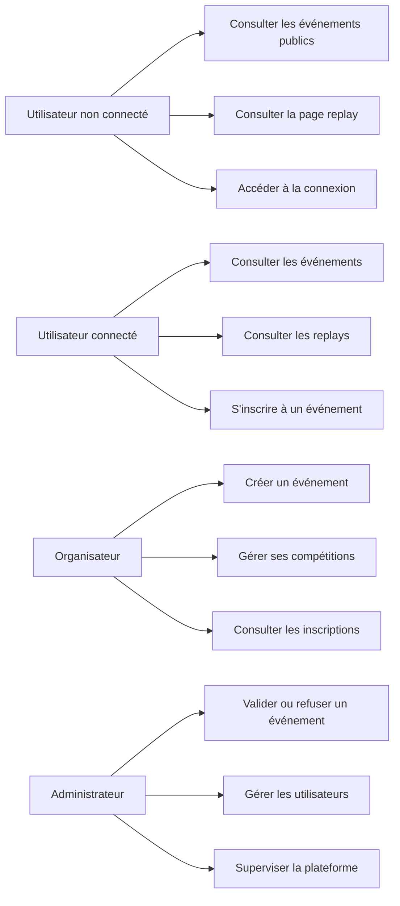

# Diagramme de cas d’utilisation - Esportify+

```mermaid
flowchart LR
  Public[Utilisateur non connecté]
  User[Utilisateur connecté]
  Organizer[Organisateur]
  Admin[Administrateur]

  Public --> UC1[Consulter les événements publics]
  Public --> UC2[Consulter la page replay]
  Public --> UC3[Accéder à la connexion]

  User --> UC4[Consulter les événements]
  User --> UC5[Consulter les replays]
  User --> UC6[S'inscrire à un événement]

  Organizer --> UC7[Créer un événement]
  Organizer --> UC8[Gérer ses compétitions]
  Organizer --> UC9[Consulter les inscriptions]

  Admin --> UC10[Valider ou refuser un événement]
  Admin --> UC11[Gérer les utilisateurs]
  Admin --> UC12[Superviser la plateforme]
```