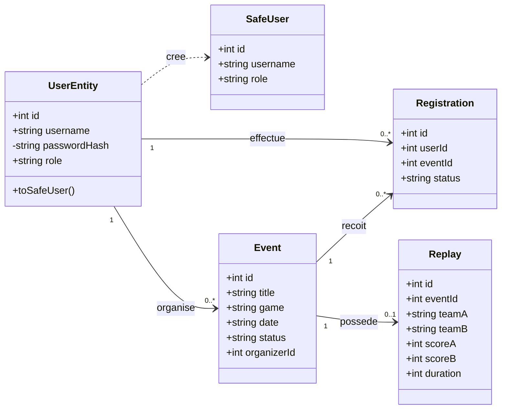

Diagramme de classes - Esportify+

Objectif du document

Ce document présente une modélisation orientée objet simplifiée du projet Esportify+.

L’objectif est de représenter les principales entités manipulées par l’application, leurs responsabilités et leurs relations.

Ce diagramme complète :

le MCD ;

la documentation SQL ;

la documentation POO ;

les cas d’utilisation ;

le diagramme de séquence de connexion.

Classes principales

UserEntity

UserEntity représente un utilisateur de la plateforme.

Attributs principaux :

id ;

username ;

passwordHash ;

role.

Rôles possibles :

player ;

organizer ;

admin.

Responsabilités :

représenter un compte utilisateur ;

participer à l’authentification ;

différencier les droits selon le rôle ;

protéger les données sensibles ;

produire une représentation sécurisée de l’utilisateur.

SafeUser

SafeUser représente les données utilisateur pouvant être envoyées au frontend.

Il ne contient pas passwordHash.

Attributs principaux :

id ;

username ;

role.

Event

Event représente un événement e-sport.

Attributs principaux :

id ;

title ;

game ;

date ;

status ;

organizerId.

Registration

Registration représente l’inscription d’un utilisateur à un événement.

Attributs principaux :

id ;

userId ;

eventId ;

status.

Replay

Replay représente un replay associé à un événement.

Attributs principaux :

id ;

eventId ;

teamA ;

teamB ;

scoreA ;

scoreB ;

duration.

Relations entre les classes

UserEntity produit une représentation sécurisée SafeUser ;

un organisateur peut gérer plusieurs événements ;

un joueur peut effectuer plusieurs inscriptions ;

un événement peut recevoir plusieurs inscriptions ;

un événement peut posséder aucun ou un seul replay.

## Diagramme de classes Mermaid

Lecture du diagramme

UserEntity représente le compte utilisateur conservé dans le backend.

Le rôle de l’utilisateur est limité aux valeurs player, organizer et admin.

Lorsqu’une réponse doit être envoyée au frontend, UserEntity produit un objet SafeUser. Cette représentation ne contient pas passwordHash, ce qui évite d’exposer une donnée sensible.

Un organisateur peut gérer plusieurs événements. Un joueur peut effectuer plusieurs inscriptions. Un événement peut recevoir plusieurs inscriptions et être associé à aucun ou un seul replay.

Différence avec le MCD

Le MCD représente principalement la structure des données destinées à SQLite.

Le diagramme de classes présente une vue orientée objet :

les entités manipulées dans le code ;

leurs attributs ;

leurs responsabilités ;

leurs relations ;

la transformation de UserEntity vers SafeUser.

Les deux documents sont complémentaires.

Limites du diagramme

Ce diagramme reste volontairement simplifié.

Il ne représente pas :

toutes les routes Express ;

les services ;

les repositories ;

les middlewares ;

toutes les méthodes du backend ;

tous les détails du frontend.

Les classes Event, Registration et Replay représentent les principales entités du domaine, même si elles ne disposent pas toutes d’une classe TypeScript complète dans le code actuel.

Conclusion

Ce diagramme apporte une vue orientée objet du projet Esportify+.

Il permet de comprendre :

les rôles utilisateur ;

la protection des données sensibles ;

la transformation vers SafeUser ;

les relations entre les utilisateurs, les événements, les inscriptions et les replays ;

la cohérence entre la conception, SQLite et le backend.

Le bloc Mermaid intégré permet de conserver un schéma modifiable et régénérable.