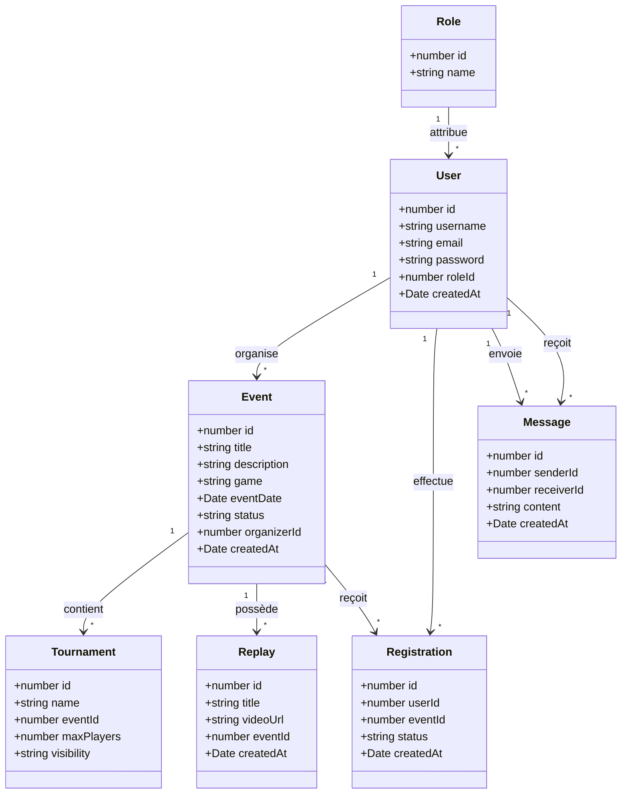

# Diagramme de classes - Esportify+

## Description

Ce diagramme de classes présente les principales entités utilisées dans le projet Esportify+.

Il permet de visualiser la structure logique des données ainsi que les relations entre les utilisateurs, les rôles, les événements, les tournois, les replays, les messages et les inscriptions.

---

## Diagramme Mermaid

---

## Objectif du diagramme

Ce diagramme permet de représenter les principales classes métiers du projet Esportify+.

Il montre les relations entre les utilisateurs, les rôles, les événements, les tournois, les replays, les inscriptions et les messages.

Il sert de support à la compréhension de la structure logique du projet et complète le MCD ainsi que le schéma SQL.
