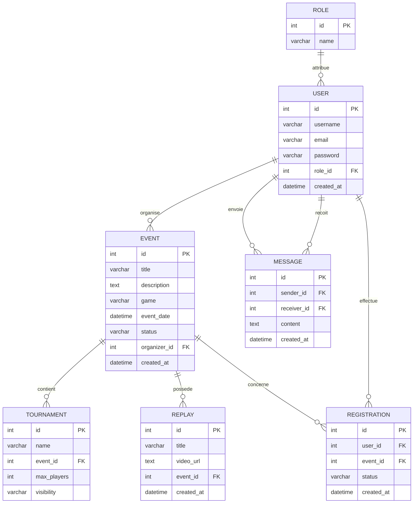

# MCD — Esportify+

## Description

Esportify+ est une plateforme de gestion d’événements e-sport. Elle permet de consulter des compétitions, de gérer les utilisateurs selon leur rôle et d’intégrer des événements, des inscriptions, des tournois, des replays et des messages.

---

## Diagramme Mermaid



---

## Entités principales

### User

L’entité `User` contient les informations liées aux utilisateurs.

| Champ | Type | Description |
|---|---|---|
| `id` | INT | Identifiant utilisateur |
| `username` | VARCHAR | Nom d’utilisateur |
| `email` | VARCHAR | Adresse e-mail |
| `password` | VARCHAR | Mot de passe |
| `role_id` | INT | Rôle associé |
| `created_at` | DATETIME | Date de création |

### Role

L’entité `Role` définit le rôle attribué à chaque utilisateur.

| Champ | Type | Description |
|---|---|---|
| `id` | INT | Identifiant du rôle |
| `name` | VARCHAR | Nom du rôle |

Rôles prévus :

- `player` ;
- `organizer` ;
- `admin`.

### Event

L’entité `Event` contient les événements proposés sur la plateforme.

| Champ | Type | Description |
|---|---|---|
| `id` | INT | Identifiant de l’événement |
| `title` | VARCHAR | Nom de l’événement |
| `description` | TEXT | Description |
| `game` | VARCHAR | Jeu concerné |
| `event_date` | DATETIME | Date de l’événement |
| `status` | VARCHAR | Statut |
| `organizer_id` | INT | Organisateur associé |
| `created_at` | DATETIME | Date de création |

Statuts possibles :

- `pending` ;
- `validated` ;
- `refused` ;
- `cancelled` ;
- `live` ;
- `upcoming`.

### Tournament

L’entité `Tournament` contient les tournois associés aux événements.

| Champ | Type | Description |
|---|---|---|
| `id` | INT | Identifiant du tournoi |
| `name` | VARCHAR | Nom du tournoi |
| `event_id` | INT | Événement associé |
| `max_players` | INT | Nombre maximal de joueurs |
| `visibility` | VARCHAR | Visibilité publique ou privée |

### Replay

L’entité `Replay` contient les vidéos associées aux événements.

| Champ | Type | Description |
|---|---|---|
| `id` | INT | Identifiant du replay |
| `title` | VARCHAR | Titre |
| `video_url` | TEXT | Adresse de la vidéo |
| `event_id` | INT | Événement associé |
| `created_at` | DATETIME | Date de création |

### Message

L’entité `Message` représente les échanges entre utilisateurs.

| Champ | Type | Description |
|---|---|---|
| `id` | INT | Identifiant du message |
| `sender_id` | INT | Expéditeur |
| `receiver_id` | INT | Destinataire |
| `content` | TEXT | Contenu |
| `created_at` | DATETIME | Date de création |

### Registration

L’entité `Registration` relie un utilisateur à un événement.

| Champ | Type | Description |
|---|---|---|
| `id` | INT | Identifiant de l’inscription |
| `user_id` | INT | Utilisateur associé |
| `event_id` | INT | Événement associé |
| `status` | VARCHAR | Statut de l’inscription |
| `created_at` | DATETIME | Date de création |

Statuts possibles :

- `pending` ;
- `accepted` ;
- `refused` ;
- `confirmed`.

---

## Relations et cardinalités

### Role — User

Un rôle peut être attribué à plusieurs utilisateurs.  
Un utilisateur possède un seul rôle.

```text
Role (1,n) → User (1,1)
```

### User — Event

Un organisateur peut créer plusieurs événements.  
Un événement est créé par un seul organisateur.

```text
User (0,n) → Event (1,1)
```

### Event — Tournament

Un événement peut contenir plusieurs tournois.  
Un tournoi appartient à un seul événement.

```text
Event (0,n) → Tournament (1,1)
```

### Event — Replay

Un événement peut posséder plusieurs replays.  
Un replay appartient à un seul événement.

```text
Event (0,n) → Replay (1,1)
```

### User — Message

Un utilisateur peut envoyer et recevoir plusieurs messages.  
Chaque message possède un seul expéditeur et un seul destinataire.

```text
User expéditeur (0,n) → Message (1,1)
User destinataire (0,n) → Message (1,1)
```

### User — Registration — Event

Un utilisateur peut participer à plusieurs événements.  
Un événement peut accueillir plusieurs participants.

Chaque inscription concerne un seul utilisateur et un seul événement.

```text
User (0,n) → Registration (1,1)
Event (0,n) → Registration (1,1)
```

---

## Règles de gestion

- Un utilisateur possède obligatoirement un rôle.
- Un événement est obligatoirement lié à un organisateur.
- Un tournoi est obligatoirement lié à un événement.
- Un replay est obligatoirement lié à un événement.
- Une inscription relie obligatoirement un utilisateur à un événement.
- Un utilisateur ne peut pas s’inscrire deux fois au même événement.
- Un message possède un expéditeur et un destinataire.
- Un administrateur peut gérer les utilisateurs, les événements et les contenus.
- Un organisateur peut créer et gérer ses événements.
- Un joueur peut consulter les événements et s’y inscrire.

---

## Lien avec le schéma relationnel

Le schéma SQL prévoit les tables suivantes :

- `roles` ;
- `users` ;
- `events` ;
- `tournaments` ;
- `replays` ;
- `registrations` ;
- `messages`.

Les clés primaires, les clés étrangères et les contraintes `CHECK`, `UNIQUE` et `FOREIGN KEY` assurent la cohérence des données.

Le backend Express utilise SQLite, Better-SQLite3, Zod ainsi qu’une architecture organisée en routes, services, repositories et entités métier.

---

## Objectif du MCD

Ce modèle présente les principales entités d’Esportify+ et leurs relations.

Il sert de base à la construction du schéma SQL et permet de justifier les clés primaires, les clés étrangères et les cardinalités utilisées dans le projet.