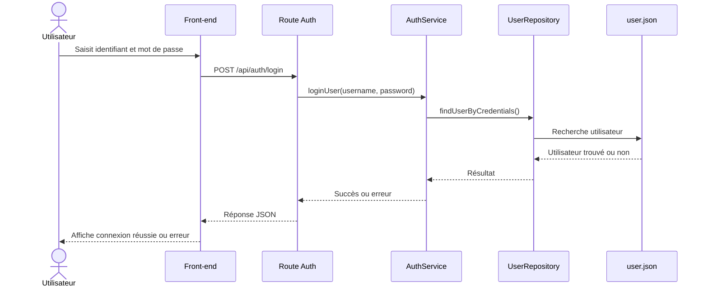

# Diagramme de séquence - Connexion utilisateur

# Explication du fonctionnement

1. L'utilisateur saisit ses identifiants dans l'interface.
2. Le front-end envoie une requête POST vers l'API d'authentification.
3. La route reçoit la requête et transmet les informations au service.
4. Le service d'authentification traite la demande.
5. Le service interroge le dépôt de données.
6. Le dépôt consulte le fichier user.json.
7. Si l'utilisateur existe et que les informations sont valides, une réponse positive est renvoyée.
8. La route retourne une réponse JSON au front-end.
9. Le front-end affiche le résultat à l'utilisateur.

# Objectif

Le but de ce diagramme est de représenter le flux complet de connexion dans Esportify+.

Il met en évidence la séparation des responsabilités entre le front-end, les routes, les services et la couche de données utilisée par l'application.
