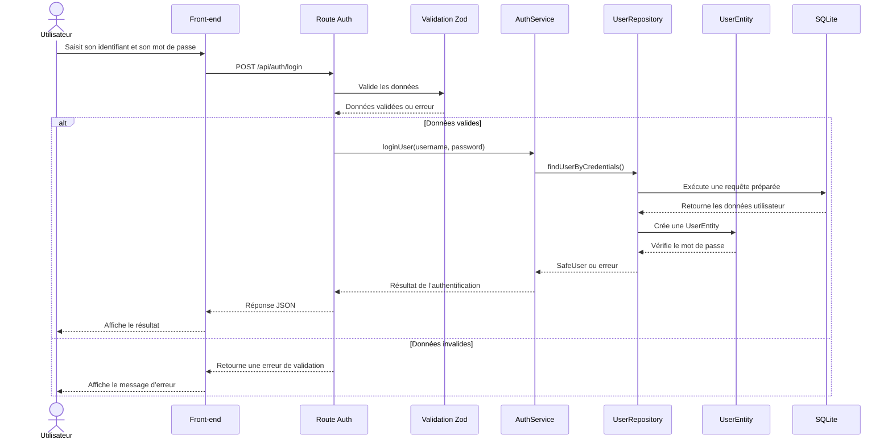

# Diagramme de séquence — Connexion utilisateur

## Description

Ce document présente le déroulement complet de la connexion d’un utilisateur dans **Esportify+**.

Il montre les échanges entre l’interface, le backend Express, la validation des données, le service d’authentification, le repository et la base SQLite.

---

## Diagramme Mermaid

---

## Explication du fonctionnement

L’utilisateur saisit son identifiant et son mot de passe dans l’interface.

Le front-end envoie ensuite une requête `POST` vers la route `/api/auth/login`. La route utilise Zod pour vérifier le format des données reçues.

Lorsque les données sont valides, le service d’authentification appelle le repository utilisateur. Celui-ci interroge SQLite avec une requête préparée, puis transforme les données obtenues en `UserEntity`.

L’entité vérifie le mot de passe et retourne un `SafeUser` lorsque l’authentification réussit. La route renvoie ensuite une réponse JSON au front-end.

En cas de données invalides ou d’échec de l’authentification, un message d’erreur est retourné à l’utilisateur.

---

## Séparation des responsabilités

Le diagramme met en évidence les responsabilités suivantes :

- le front-end collecte les identifiants et affiche le résultat ;
- la route reçoit la requête et renvoie la réponse ;
- Zod valide les données d’entrée ;
- `AuthService` gère la logique d’authentification ;
- `UserRepository` accède à SQLite ;
- `UserEntity` vérifie les informations utilisateur ;
- SQLite conserve les données.

---

## Sécurité

Les requêtes vers SQLite sont préparées afin de limiter les risques d’injection SQL.

Le mot de passe n’est jamais renvoyé au front-end. Seules les données sécurisées contenues dans le `SafeUser` sont retournées après une authentification réussie.

---

## Objectif

Ce diagramme représente le flux de connexion d’Esportify+ et montre la séparation entre l’interface, la validation, la logique métier et l’accès aux données.

Il facilite également la compréhension, la maintenance et les futures évolutions du système d’authentification.