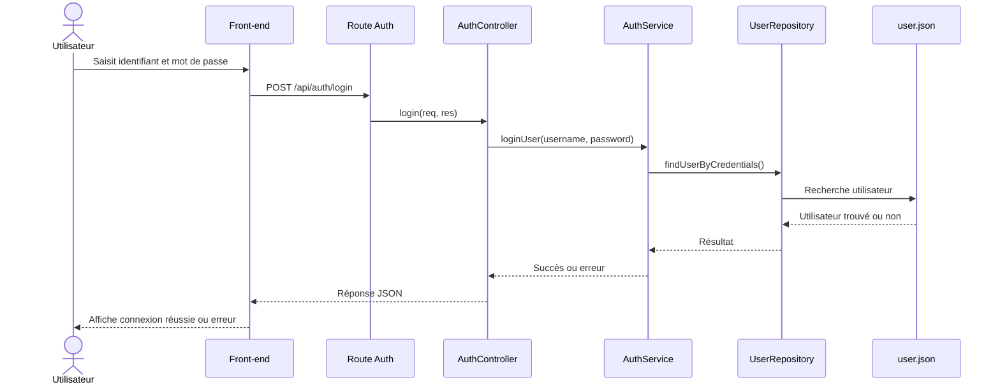

# Diagramme de séquence - Connexion utilisateur

```mermaid
sequenceDiagram
  actor User as Utilisateur
  participant Front as Front-end
  participant Route as Route Auth
  participant Controller as AuthController
  participant Service as AuthService
  participant Repository as UserRepository
  participant Data as user.json

  User->>Front: Saisit identifiant et mot de passe
  Front->>Route: POST /api/auth/login
  Route->>Controller: login(req, res)
  Controller->>Service: loginUser(username, password)
  Service->>Repository: findUserByCredentials()
  Repository->>Data: Recherche utilisateur
  Data-->>Repository: Utilisateur trouvé ou non
  Repository-->>Service: Résultat
  Service-->>Controller: Succès ou erreur
  Controller-->>Front: Réponse JSON
  Front-->>User: Affiche connexion réussie ou erreur
```