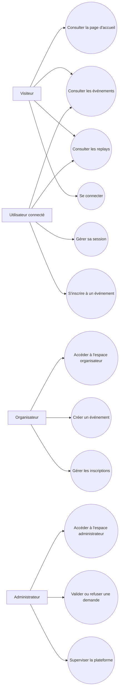

# Diagramme de cas d'utilisation - Esportify+

## Description

Ce document présente les principaux cas d'utilisation du projet Esportify+.

Il permet d'identifier les différents acteurs de la plateforme ainsi que les fonctionnalités auxquelles ils peuvent accéder.

---

## Acteurs

Le projet distingue plusieurs types d'acteurs :

* visiteur ;
* utilisateur connecté ;
* organisateur ;
* administrateur.

---

## Diagramme Mermaid

---

## Détail des cas d'utilisation

### Visiteur

Un visiteur peut :

* consulter la page d'accueil ;
* consulter les événements disponibles ;
* consulter les replays ;
* accéder à la page de connexion.

### Utilisateur connecté

Un utilisateur connecté peut :

* consulter les événements ;
* consulter les replays ;
* gérer sa session ;
* s'inscrire à un événement.

### Organisateur

Un organisateur peut :

* accéder à son espace organisateur ;
* créer un événement ;
* gérer les inscriptions liées à ses événements.

### Administrateur

Un administrateur peut :

* accéder à l'espace administrateur ;
* valider ou refuser des demandes ;
* superviser la plateforme.

---

## Règles d'accès

Les accès sont limités selon le rôle de l'utilisateur.

* un visiteur accède uniquement aux pages publiques ;
* un utilisateur connecté accède aux fonctionnalités joueur ;
* un organisateur accède à l'espace organisateur ;
* un administrateur accède à l'espace d'administration.

---

## Objectif du diagramme

Ce diagramme permet de visualiser les interactions principales entre les acteurs et les fonctionnalités du projet.

Il sert à clarifier les responsabilités de chaque rôle et complète la logique de gestion des rôles utilisée dans l'application.
