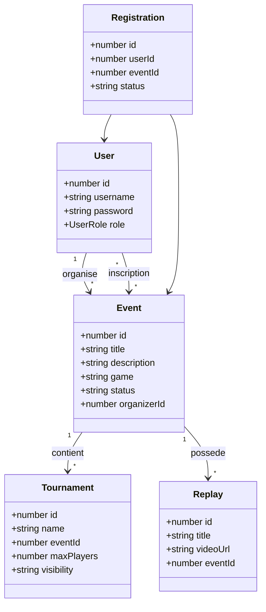

# Diagramme de classes - Esportify+

```mermaid
classDiagram
  class User {
    +number id
    +string username
    +string password
    +UserRole role
  }

  class Event {
    +number id
    +string title
    +string description
    +string game
    +string status
    +number organizerId
  }

  class Tournament {
    +number id
    +string name
    +number eventId
    +number maxPlayers
    +string visibility
  }

  class Replay {
    +number id
    +string title
    +string videoUrl
    +number eventId
  }

  class Registration {
    +number id
    +number userId
    +number eventId
    +string status
  }

  User "1" --> "*" Event : organise
  Event "1" --> "*" Tournament : contient
  Event "1" --> "*" Replay : possede
  User "*" --> "*" Event : inscription
  Registration --> User
  Registration --> Event
```