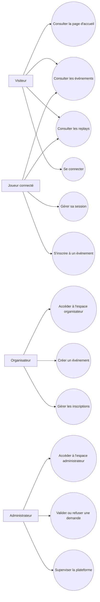

# Diagramme de cas d’utilisation — Esportify+

## Description

Ce document présente les principaux cas d’utilisation du projet **Esportify+**.

Il permet d’identifier les différents acteurs de la plateforme ainsi que les fonctionnalités auxquelles ils peuvent accéder.

---

## Acteurs

Le projet distingue quatre types d’acteurs :

- visiteur ;
- joueur connecté ;
- organisateur ;
- administrateur.

---

## Diagramme Mermaid

---

## Détail des cas d’utilisation

### Visiteur

Un visiteur peut :

- consulter la page d’accueil ;
- consulter les événements disponibles ;
- consulter les replays ;
- accéder à la page de connexion.

### Joueur connecté

Un joueur connecté peut :

- consulter les événements ;
- consulter les replays ;
- gérer sa session ;
- utiliser l’inscription à un événement prévue dans la démonstration.

### Organisateur

Un organisateur peut :

- accéder à son espace organisateur ;
- utiliser la création d’événement prévue dans la démonstration ;
- consulter les fonctions de gestion des inscriptions.

### Administrateur

Un administrateur peut :

- accéder à l’espace administrateur ;
- utiliser les actions de validation ou de refus ;
- superviser la plateforme ;
- consulter les fonctions de gestion des utilisateurs.

---

## Règles d’accès

Les accès sont limités selon le rôle de l’utilisateur :

- le visiteur accède uniquement aux pages publiques ;
- le joueur connecté accède aux fonctions liées aux événements et à sa session ;
- l’organisateur accède à son espace et aux fonctions de gestion des événements ;
- l’administrateur accède aux fonctions de supervision et d’administration.

---

## Lien avec le backend

Les droits d’accès reposent sur les rôles suivants :

- `player` ;
- `organizer` ;
- `admin`.

Ces rôles sont utilisés dans :

- le backend Express ;
- les services métier ;
- les données utilisateur ;
- la gestion de session côté client.

Cette organisation assure la cohérence entre l’interface utilisateur et les règles appliquées par l’application.

---

## Limite actuelle

La connexion, la vérification des utilisateurs et la lecture de SQLite sont opérationnelles dans le backend.

Certaines fonctions métier, comme les inscriptions, la création d’événements et les décisions administratives, restent simulées dans l’interface et ne sont pas encore enregistrées durablement dans SQLite.

---

## Objectif du diagramme

Ce diagramme présente les principales interactions entre les acteurs et les fonctionnalités d’Esportify+.

Il clarifie les responsabilités de chaque rôle, accompagne la conception du backend et facilite les futures évolutions du projet.